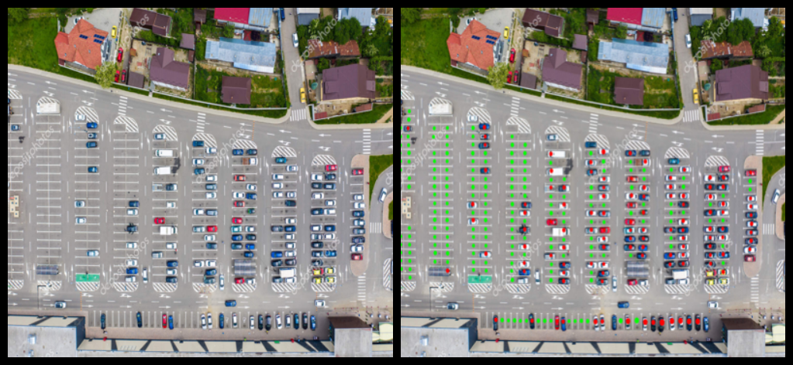

# parking-spot-checker

A Python application to detect open parking spaces in images of parking lots for use in real-time systems.

There are several different versions of the model trained with different epoch and batch sizes, each with their own
strengths and weaknesses.

## Examples

### High Angle

The model works very well with images taken from a **high angle**, where the view is clear and the cars are easily
distinguishable.

### Lower Angle

The model also works with images taken from a **lower angle**, where cars tend to obstruct the view of others.

### Large Parking Lots

In images covering many spaces, the model performs accurately.

---

## Usage

The program was created to be used in a real-time parking space detection system:

1. A device like a Raspberry Pi can be used to capture images and stream them in the MJPEG format.
2. A processing server receives the MJPEG stream[^1] and processes frames with the custom model, returning a stream with
   annotated parking spaces.
3. The annotated stream can be viewed on a web interface or a dedicated application.

[^1]: For simplicity, I used the free VPN service [Tailscale](https://tailscale.com/) to securely access the feed from a
device on a different network.

---

## Dataset Credits

This project includes data from external sources. Each dataset belongs to its respective authors and is subject to their
respective licenses. Please refer to their official sources for licensing details before using the data or this project.
Proper attribution is provided below.

### **CNRPark+EXT Dataset**

**Source:** [CNRPark](http://cnrpark.it/)
**License:** Open Data Commons Open Database License (ODbL) v1.0
**Usage Terms:**

- You are free to **share**, **modify**, and **use** this dataset for any purpose, including commercial use.
- You **must** provide attribution and distribute any modified versions under the same license.

**Citation:**
Alfredo Paolanti, Paolo Zoppetti, Alessandro Pierdicca, Emanuele Frontoni,
*"CNRPark+EXT: A Large Dataset for Parking Area and Parking Space Classification"*,
*IEEE CVPRW*, 2018.
[DOI: 10.1109/CVPRW.2018.00009](https://doi.org/10.1109/CVPRW.2018.00009)

### **DeteksiParkirKosong Dataset**

**Source:** [Roboflow Universe](https://universe.roboflow.com/skripsijeremy/deteksiparkirkosong)
**License:** Creative Commons Attribution 4.0 International (CC BY 4.0)
**Usage Terms:**

- You are free to **share**, **modify**, and **use** this dataset for any purpose, including commercial use.
- You **must** provide proper attribution to the dataset author.

**Attribution:**
*"DeteksiParkirKosong Dataset"* by **SkripsiJeremy**, available on Roboflow Universe.

### **PKLot Dataset**

**Source:** [PKLot Dataset](http://web.inf.ufpr.br/vri/parking-lot-database)
**License:** Creative Commons Attribution 4.0 (CC BY 4.0)
**Usage Terms:**

- You are free to **share**, **modify**, and **use** this dataset for any purpose, including commercial use.
- You **must** acknowledge the source by citing the original paper in any publications using this dataset.

**Citation:**
Paulo R.L. de Almeida, Luiz S. Oliveira, Alceu S. Britto Jr., Eunelson J. Silva Jr., Alessandro L. Koerich,
*"PKLot – A robust dataset for parking lot classification"*,
*Expert Systems with Applications*, Volume 42, 2015, Pages 4937–4949.
[DOI: 10.1016/j.eswa.2015.02.009](https://doi.org/10.1016/j.eswa.2015.02.009)

---

### **License Disclaimer**

This project does not claim ownership of these datasets; I only utilize them for research and development purposes.